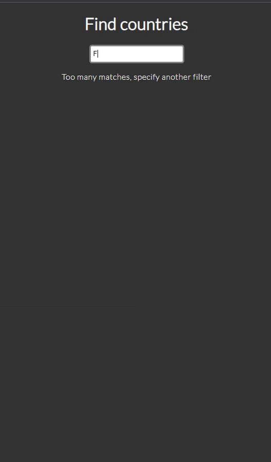

# Countries-Backend

This repository contains the backend codebase for the Countries React app that allows users to search for countries, retrieve information about them and view weather details.

The backend serves as a proxy server to enhance security by allowing the frontend to fetch weather data without exposing sensitive API keys directly to the client.

You can access the live version of the app [here](https://countries-backend-wjef.onrender.com/)

## Purpose of the Backend

The primary purpose of the backend is to act as an intermediary between the frontend and external APIs, such as the OpenWeatherMap API. This architecture helps protect sensitive API keys and credentials from being exposed to the client-side code, thus improving the overall security of the application.

By utilizing the backend as a proxy server, the frontend can send requests to the backend, which then securely communicates with external APIs on behalf of the client. This ensures that API keys and other confidential information remain hidden from potential attackers.

## Technologies Used

- Node.js: Backend runtime environment.
- Express: Web application framework for Node.js.
- Axios: Promise-based HTTP client for making API requests.
- Cors: Middleware for handling cross-origin requests.

